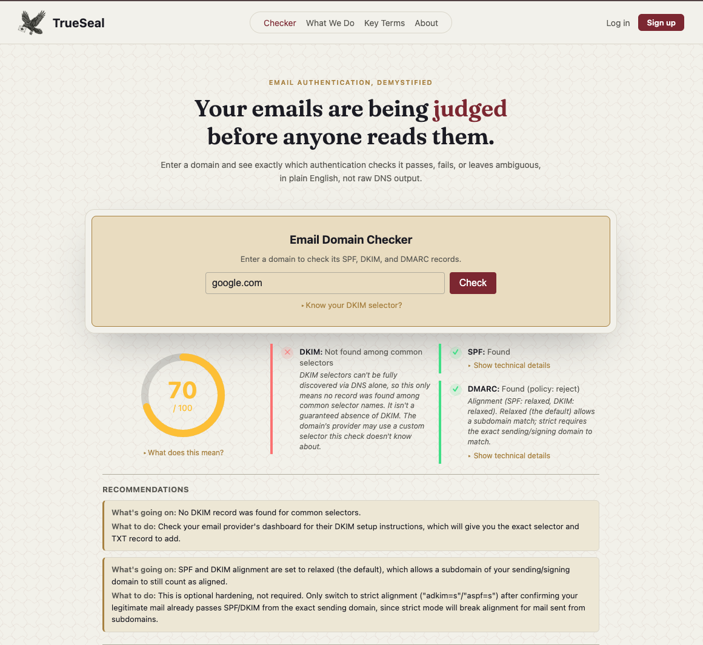

# TrueSeal

A tool that checks a domain's SPF, DKIM, and DMARC records, scores its email security, and explains the results in plain language, not just raw DNS output.

**Live at [trueseal.help](https://trueseal.help)**

## What it does

Every time an email is sent, the receiving server checks whether it's really from the domain it claims to be. This tool runs those same checks (SPF, DKIM, DMARC) against any domain and explains what's working, what's missing, and what to fix, in plain English.

Unlike most free checkers, which either dump raw technical output or oversimplify to the point of being misleading, this tool aims for both: accurate detail, explained clearly.

## Features

- **SPF, DKIM, and DMARC detection** via real-time DNS lookups
- **Multiple SPF record detection** - flags invalid configurations per RFC 7208
- **SPF DNS lookup counting** - recursively counts lookups through include: chains and flags records approaching or exceeding the 10-lookup limit
- **DKIM ambiguity handling** - distinguishes "no record found" from "record exists but has an empty/revoked key," and is explicit about the limits of selector-based detection
- **DMARC policy strength scoring** - differentiates p=none, p=quarantine, and p=reject, and flags missing rua reporting addresses
- **Subdomain and nonexistent-domain detection**
- Rate limiting, input validation, and security headers (Helmet) to prevent abuse

## Tech stack

- **Backend:** Node.js, Express
- **Frontend:** Vanilla HTML/CSS/JS (no framework)
- **DNS resolution:** Node's built-in dns module

## Running it locally

git clone https://github.com/misha333c/TrueSeal.git
cd TrueSeal
npm install
npm start

Then open http://localhost:3000.

## Why I built this

This started as a first real project to learn backend development properly, real DNS lookups, real edge cases, real RFCs, not a tutorial clone. Along the way it became something genuinely useful in its own right.
